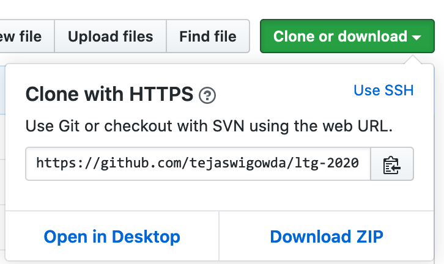
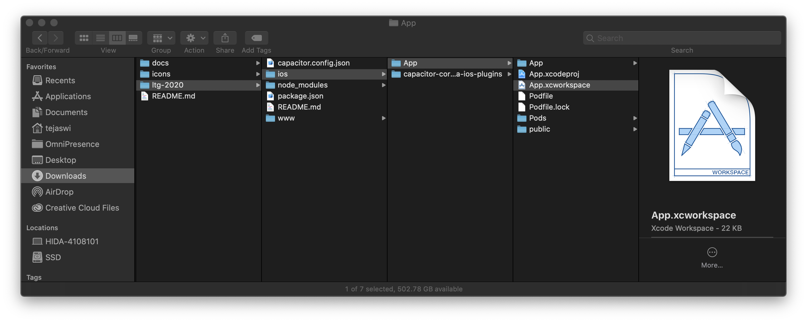

# ltg2020-app

## How to compile

1. Download or clone this repository.

2. Open project workspace in xCode.

3. Compile.

4. Run on Simulator or device!

## Under the hood

The app is built using web technologies. If you can make a website you can make an app!

## References
- <https://capacitor.ionicframework.com/>

- <https://gist.github.com/tejaswigowda/8449ed1365a255bca26eb6c519755db2>

- <https://www.w3schools.com/html/>

- <https://www.w3schools.com/css/>

- <https://www.w3schools.com/js/>
